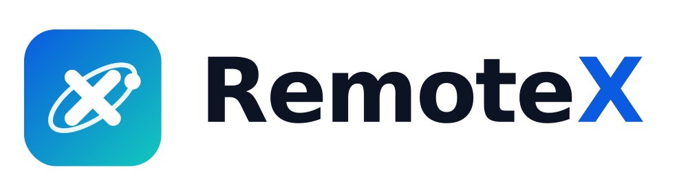

<p align="center">
  <br>
  <b>Secure remote desktop &amp; remote support</b><br>
  by <b>SL Brothers</b>
</p>

<p align="center">
  <a href="#-download">Download</a> •
  <a href="#-how-it-works">How it works</a> •
  <a href="#-privacy--security">Privacy</a> •
  <a href="DEPLOY.md">Self-hosting</a>
</p>

---

## ⬇️ Download

### 🪟 Windows — recommended

<p align="center">
  <a href="https://github.com/sohailk007/RemoteX/releases/latest/download/RemoteX-1.0.1-Windows-x86_64.msi">
    <b>⬇️ Download RemoteX for Windows (.msi installer)</b>
  </a>
</p>

Run the installer once and RemoteX is ready to use. **This is the version you want** — it installs RemoteX properly, so it works with Windows UAC prompts (your technician can click admin dialogs) and starts with your computer.

<sub>Prefer not to install? There's a <a href="https://github.com/sohailk007/RemoteX/releases/latest">portable .exe</a> — but it can't interact with UAC dialogs, so the screen goes black when one appears. Use the installer for anything ongoing.</sub>

### All platforms

| Your device | Download | Notes |
|---|---|---|
| **Windows** (most PCs) | **[Installer (.msi)](https://github.com/sohailk007/RemoteX/releases/latest/download/RemoteX-1.0.1-Windows-x86_64.msi)** ⭐ | Recommended |
| **Windows** (portable) | [.exe](https://github.com/sohailk007/RemoteX/releases/latest/download/RemoteX-1.0.1-Windows-x86_64.exe) | No install needed |
| **Mac** (M1/M2/M3/M4) | [Apple Silicon .dmg](https://github.com/sohailk007/RemoteX/releases/latest/download/RemoteX-1.0.1-macOS-AppleSilicon.dmg) | See [Mac note](#-mac-users-read-this) |
| **Mac** (Intel) | [Intel .dmg](https://github.com/sohailk007/RemoteX/releases/latest/download/RemoteX-1.0.1-macOS-Intel.dmg) | See [Mac note](#-mac-users-read-this) |
| **Android** | [Universal .apk](https://github.com/sohailk007/RemoteX/releases/latest/download/RemoteX-1.0.1-Android-universal.apk) | Works on almost all phones |
| **Ubuntu / Debian** | [.deb](https://github.com/sohailk007/RemoteX/releases/latest/download/RemoteX-1.0.1-Linux-x86_64.deb) | `sudo apt install ./RemoteX-*.deb` |
| **Fedora / RHEL** | [.rpm](https://github.com/sohailk007/RemoteX/releases/latest/download/RemoteX-1.0.1-Linux-x86_64.rpm) | `sudo dnf install ./RemoteX-*.rpm` |
| **Any Linux** | [.AppImage](https://github.com/sohailk007/RemoteX/releases/latest/download/RemoteX-1.0.1-Linux-x86_64.AppImage) | `chmod +x` then run |

> **Not sure which?** On Windows pick the **.msi**. On Mac, check  → *About This Mac* — if it says **Apple M1/M2/M3/M4** take Apple Silicon, otherwise Intel.

**[→ See all downloads (ARM64, Flatpak, openSUSE, Arch, 32-bit…)](https://github.com/sohailk007/RemoteX/releases/latest)**

*iOS is not available — Apple only permits installs through the App Store.*

---

## 🚀 How it works

1. **Download and open RemoteX.** It shows your **Session ID** and a **one-time password**.
2. **Share those two things** with your SL Brothers technician.
3. **They connect** — with your permission. You watch the whole session on your screen.
4. **Disconnect anytime** — either side can end the session instantly.

Your **IP address is never shown or shared**. The connection uses only the Session ID and password.

---

## 🔒 Privacy & security

- **End-to-end encrypted** connections.
- **No IP addresses exchanged** between you and the technician.
- **Microphone off by default** — RemoteX does not capture audio unless you explicitly enable it.
- **You stay in control** — the session shows an indicator while active, and either side can disconnect.
- **Your data stays yours** — session contents are never stored.

Full details: **[Privacy Statement](PRIVACY.md)**

---

## 🍎 Mac users, read this

The Mac app isn't code-signed yet, so macOS will say *"RemoteX is damaged"*. It isn't — it just has no Apple certificate. To run it:

1. Open the `.dmg`, drag **RemoteX** to **Applications**.
2. Open **Terminal** and run once:
   ```bash
   xattr -cr /Applications/RemoteX.app
   ```
3. Open RemoteX normally.

*Windows may likewise show "Windows protected your PC" → click **More info** → **Run anyway**.*

---

## 🏢 Self-hosting

RemoteX can run entirely on your own server, so no session ever touches a third party.
See **[DEPLOY.md](DEPLOY.md)** for the full guide (server setup, configuration, and building releases).

---

## 📄 Open source & credits

RemoteX is **open-source software** licensed under the **[GNU AGPL-3.0](LICENCE)**.

RemoteX is a modified version (fork) of **[RustDesk](https://github.com/rustdesk/rustdesk)**, an open-source remote desktop project. Full credit to the RustDesk authors and contributors for the original work.

- Original work: © RustDesk authors and contributors
- Modifications: © 2026 SL Brothers

The complete corresponding source code — including all SL Brothers modifications — is in this repository, as required by the AGPL-3.0. See **[NOTICE.md](NOTICE.md)** for details.

RemoteX and SL Brothers are not affiliated with, endorsed by, or sponsored by the RustDesk project.

> **Misuse disclaimer:** SL Brothers does not condone or support any unethical or illegal use of this software. Unauthorised access, control, or invasion of privacy is strictly against our guidelines. Only accept a remote session from someone you know and trust.
