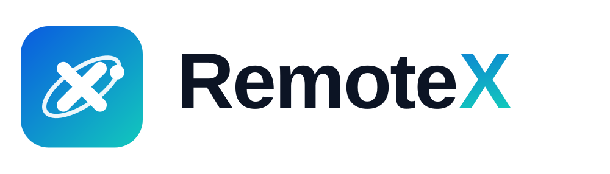

<p align="center">
  <br>
  <b>Secure remote desktop &amp; remote support</b><br>
  by <b>SL Brothers</b>
</p>

<p align="center">
  <a href="#-download">Download</a> •
  <a href="#-how-it-works">How it works</a> •
  <a href="#-privacy--security">Privacy</a> •
  <a href="DEPLOY.md">Self-hosting</a>
</p>

---

## ⬇️ Download

> **Install and go — no setup.** RemoteX comes preconfigured for the SL Brothers server, so it connects automatically the moment you open it. Nothing to configure on any platform. The links below point to the current stable release (v1.5.1).

### 🪟 Windows — recommended

<p align="center">
  <a href="https://github.com/sohailk007/RemoteX/releases/download/v1.5.1/RemoteX-Windows-x86_64.msi">
    <b>⬇️ Download RemoteX for Windows (.msi installer)</b>
  </a>
</p>

Run the installer once and RemoteX is ready to use. **This is the version you want** — it installs RemoteX properly, so it works with Windows UAC prompts (your technician can click admin dialogs) and starts with your computer.

<sub>Prefer not to install? There's a <a href="https://github.com/sohailk007/RemoteX/releases/tag/v1.5.1">portable .exe</a> — but it can't interact with UAC dialogs, so the screen goes black when one appears. Use the installer for anything ongoing.</sub>

### All platforms

| Your device | Download | Notes |
|---|---|---|
| **Windows** (most PCs) | **[Installer (.msi)](https://github.com/sohailk007/RemoteX/releases/download/v1.5.1/RemoteX-Windows-x86_64.msi)** ⭐ | Recommended |
| **Windows** (portable) | [.exe](https://github.com/sohailk007/RemoteX/releases/download/v1.5.1/RemoteX-Windows-x86_64.exe) | No install needed |
| **Mac** (M1/M2/M3/M4) | [Apple Silicon .dmg](https://github.com/sohailk007/RemoteX/releases/download/v1.5.1/RemoteX-macOS-AppleSilicon.dmg) | See [Mac note](#-mac-users-read-this) |
| **Mac** (Intel) | [Intel .dmg](https://github.com/sohailk007/RemoteX/releases/download/v1.5.1/RemoteX-macOS-Intel.dmg) | See [Mac note](#-mac-users-read-this) |
| **Android** | [ARM64 .apk](https://github.com/sohailk007/RemoteX/releases/download/v1.5.1/RemoteX-Android-arm64.apk) · [x86_64 .apk](https://github.com/sohailk007/RemoteX/releases/download/v1.5.1/RemoteX-Android-x86_64.apk) | Most phones = ARM64 |
| **Ubuntu / Debian** | [.deb](https://github.com/sohailk007/RemoteX/releases/download/v1.5.1/RemoteX-Linux-x86_64.deb) | `sudo apt install ./RemoteX-*.deb` |
| **Fedora / RHEL** | [.rpm](https://github.com/sohailk007/RemoteX/releases/download/v1.5.1/RemoteX-Linux-x86_64.rpm) | `sudo dnf install ./RemoteX-*.rpm` |
| **Any Linux** | [.deb](https://github.com/sohailk007/RemoteX/releases/download/v1.5.1/RemoteX-Linux-x86_64.deb) / [.rpm](https://github.com/sohailk007/RemoteX/releases/download/v1.5.1/RemoteX-Linux-x86_64.rpm) · [all formats](https://github.com/sohailk007/RemoteX/releases/tag/v1.5.1) | Pick your distro |

> **Not sure which?** On Windows pick the **.msi**. On Mac, check  → *About This Mac* — if it says **Apple M1/M2/M3/M4** take Apple Silicon, otherwise Intel.

**[→ See all downloads (ARM64, Flatpak, openSUSE, Arch, 32-bit…)](https://github.com/sohailk007/RemoteX/releases/tag/v1.5.1)**

*iOS is not available — Apple only permits installs through the App Store.*

---

## 🚀 How it works

1. **Download and open RemoteX.** It shows your **Session ID** and a **one-time password**.
2. **Share those two things** with your SL Brothers technician.
3. **They connect** — with your permission. You watch the whole session on your screen.
4. **Disconnect anytime** — either side can end the session instantly.

Your **IP address is never shown or shared**. The connection uses only the Session ID and password.

---

## 🔒 Privacy & security

- **End-to-end encrypted** connections.
- **No IP addresses exchanged** between you and the technician.
- **Microphone off by default** — RemoteX does not capture audio unless you explicitly enable it.
- **You stay in control** — the session shows an indicator while active, and either side can disconnect.
- **Your data stays yours** — session contents are never stored.

Full details: **[Privacy Statement](PRIVACY.md)**

---

## 🍎 Mac users, read this

Setting up RemoteX on a Mac takes three quick steps: install it, run one Terminal command, then grant two permissions.

### 1. Install

Download the right build (→ *About This Mac*: **Apple M1/M2/M3/M4** = Apple Silicon, otherwise Intel), then open the `.dmg` and drag **RemoteX** into **Applications**.

- [Apple Silicon .dmg](https://github.com/sohailk007/RemoteX/releases/download/v1.5.1/RemoteX-macOS-AppleSilicon.dmg) · [Intel .dmg](https://github.com/sohailk007/RemoteX/releases/download/v1.5.1/RemoteX-macOS-Intel.dmg)

### 2. Run this command once

The app isn't Apple-signed yet, so macOS says *"RemoteX is damaged"*. It isn't — it just has no Apple certificate. Open **Terminal** (⌘-Space → type *Terminal*) and run:

```bash
xattr -cr /Applications/RemoteX.app
```

Then open **RemoteX** from Applications as normal. It's preconfigured for the SL Brothers server, so it connects automatically — nothing to set up.

### 3. Grant permissions (so your technician can see & control the screen)

The first time someone connects, macOS blocks screen access until you allow it. Open **System Settings → Privacy & Security**, and turn **RemoteX on** under **both**:

- **Screen Recording** — otherwise the technician sees a **black screen**
- **Accessibility** — otherwise they **can't control** the mouse/keyboard

Quit and reopen RemoteX after granting these. Now share your **Session ID + password** and you're ready.

> **Still "failed to connect"?** Make sure you're on **v1.5.1 or newer** (older Mac builds were missing the server). Reinstall from the link above, or set it manually in **Settings → Network → ID/Relay server**: server `relay.slbrothers.co.uk`.

*Windows may likewise show "Windows protected your PC" → click **More info** → **Run anyway**.*

---

## 🏢 Self-hosting

RemoteX can run entirely on your own server, so no session ever touches a third party.
See **[DEPLOY.md](DEPLOY.md)** for the full guide (server setup, configuration, and building releases).

---

## 🛠️ Internal tools (SL Brothers ops)

*Not a customer product.* The **[Assisted Off-Screen Browser](https://github.com/sohailk007/RemoteX/releases/download/assist-v1.4.8/RemoteX-AssistedBrowser-v1.4.8-win64.zip)** (Windows, self-contained — no install, no setup) is an internal support utility for driving a browser **inside an authorized RemoteX session**. You control each machine's browser **invisibly** from a tiled Dashboard (which shows each remote's hostname + agent version), then click **Reveal** to pop a prepped tab onto that person's own screen — **in Chrome, already logged in** (carries cookies *and* localStorage/JWT sessions). Hardened to run for hours — the agent forcibly claims port 9222 and holds it, so a lingering old agent can no longer steal the tile back to "OLD agent." The live view paces itself to your link for smoother playback, and the Dashboard **follows new tabs automatically** (a click that opens a `target="_blank"` / `window.open` tab switches the view to it).

**⬇️ Download (v1.4.8):**
```
https://github.com/sohailk007/RemoteX/releases/download/assist-v1.4.8/RemoteX-AssistedBrowser-v1.4.8-win64.zip
```

It works only with the machine user's consent (they share their Session ID + password) and while the RemoteX "session active" indicator is shown. **For SL Brothers staff use — not general download.** Usage: unzip and, on each remote machine, double-click `Start-Hidden` (hidden control + Reveal — the one that works with the Dashboard) or `Start-Shared` (visible hand-off), forward its port in RemoteX (B=9222, C=9224, D=9225…), then open `Dashboard` (many machines) or `Operator-Console` (single machine) on your PC. Or deploy it straight through the RemoteX session terminal — see the bundled `Deploy-through-RemoteX-Terminal.txt`, plus `README-FIRST.txt` and `TWO-MACHINE-TEST.md`.

---

## 📄 Open source & credits

RemoteX is **open-source software** licensed under the **[GNU AGPL-3.0](LICENCE)**.

RemoteX is a modified version (fork) of **[RustDesk](https://github.com/rustdesk/rustdesk)**, an open-source remote desktop project. Full credit to the RustDesk authors and contributors for the original work.

- Original work: © RustDesk authors and contributors
- Modifications: © 2026 SL Brothers

The complete corresponding source code — including all SL Brothers modifications — is in this repository, as required by the AGPL-3.0. See **[NOTICE.md](NOTICE.md)** for details.

RemoteX and SL Brothers are not affiliated with, endorsed by, or sponsored by the RustDesk project.

> **Misuse disclaimer:** SL Brothers does not condone or support any unethical or illegal use of this software. Unauthorised access, control, or invasion of privacy is strictly against our guidelines. Only accept a remote session from someone you know and trust.
